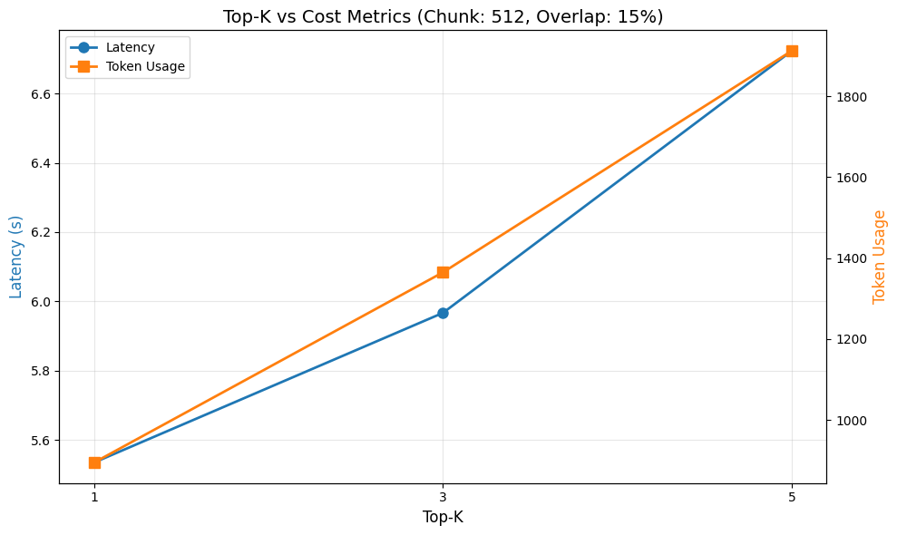
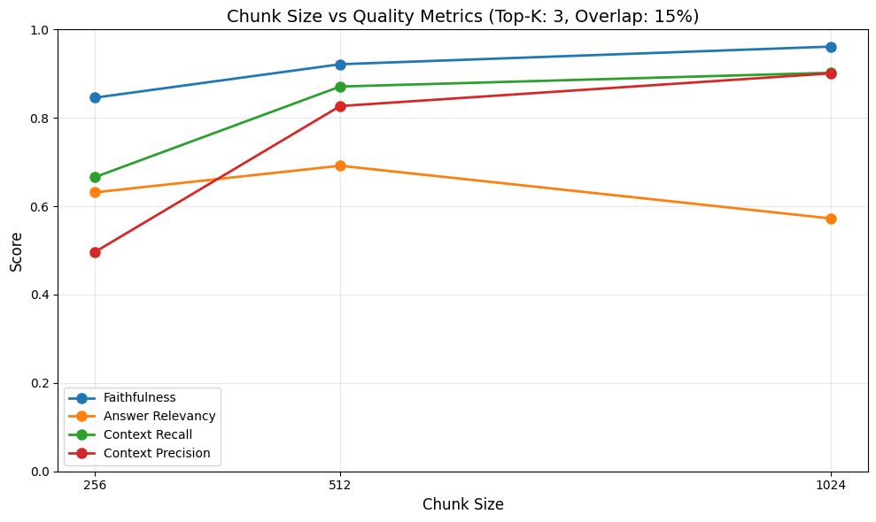
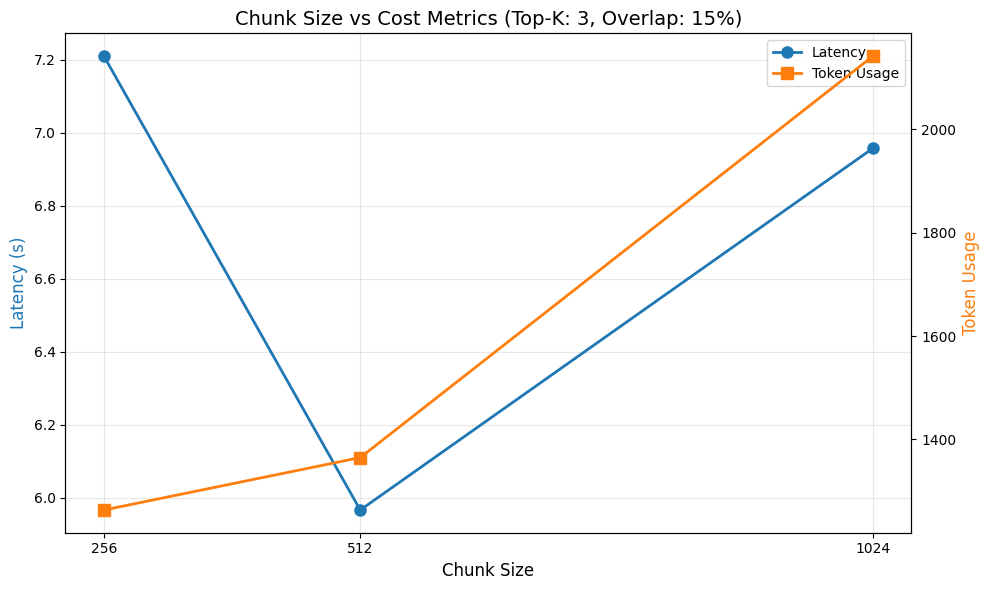
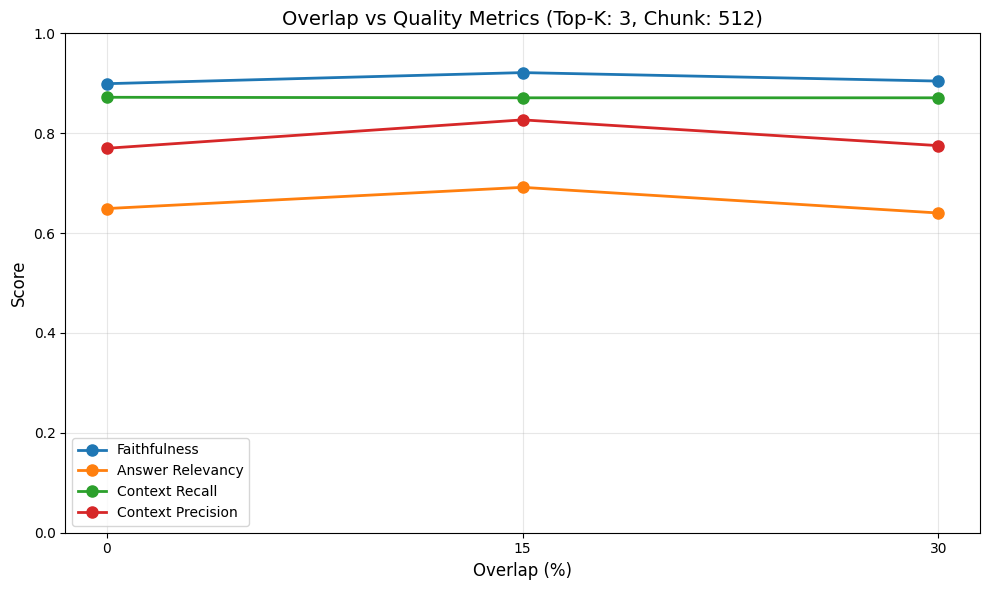

# Reproducible RAG Optimization Experiments

## Table of Contents

1. [Introduction](#1-introduction)
2. [RAG Overview](#2-rag-overview)
3. [System Overview](#3-system-overview)
4. [Experimental Setup](#4-experimental-setup)
5. [Evaluation Metrics](#5-evaluation-metrics)
6. [Hypotheses](#6-hypotheses)
7. [Result](#7-result)
8. [Discussion](#8-discussion)
9. [Appendix](#9-appendix)

## 1. Introduction

#### 연구 배경 및 문제 정의

팀 내부 Notion 및 Github 문서를 지식 베이스로 활용하는 RAG 기반 Slack Bot 프로젝트를 개발하면서, 생성된 답변 품질이 낮은 이슈를 확인했습니다. 특히 검색된 문서의 수와 문서의 분할 방식에 따라 생성되는 답변 품질이 유의미하게 차이나는 이슈를 확인했습니다.

#### 실험 목표

본 실험은 TopK, Chunk Size, Overlap 파라미터가 생성된 응답의 품질과 시스템에 미치는 영향을 정량적으로 파악하고, 각 파라미터 사이의 trade-off 를 파악하여 최적의 TopK, Chunk Size, Overlap 값을 찾아내는 것을 목표로 진행했습니다.

## 2. RAG Overview

#### RAG란?

RAG란 LLM 이 답변을 생성할 때 외부 지식 베이스에서 관련 있는 정보를 검색하고 (Retrieval) 검색된 정보를 바탕으로 답변을 생성 (Generation) 하는 기술입니다.

RAG는 외부 지식 베이스 기반으로 답변을 생성하기 때문에 답변의 근거를 제시할 수 있어 LLM 의 고질적인 환각 문제를 줄일 수 있습니다.
또한 외부 지식 베이스를 활용하여 LLM이 학습하지 못한 최신 정보나 특정 분야의 도메인 지식에 대한 답변이 필요한 경우 유용하게 활용할 수 있습니다.
RAG는 LLM 이 학습 할 수 없는 기업 내부의 프라이빗한 데이터 기반의 답변 생성이 필요할때도 활용됩니다.

#### RAG의 주요 구성 요소 및 프로세스

RAG 의 프로세스는 크게 아래의 3가지로 나눌 수 있습니다.

1. 청킹 및 인덱싱

  - Chunking: 방대한 양의 문서를 모델이 처리 가능한 적절한 크기로 자릅니다.
  - Embedding: 자른 문서를 벡터화하여 의미론적 공간에 매핑합니다.(gemini-embedding-001, text-embedding-3-small etc..)
  - Vertor Database: 임베딩된 벡터를 저장합니다. (Pinecone, ChromaDB etc..)

2. 검색

  - Query Embedding: 사용자의 질문을 문서 임베딩에 사용한 모델로 임베딩합니다.
  - Retrieval: Vector 데이터 베이스에서 사용자의 질문과 유사도가 높은 k 개의 문서 청크를 검색합니다.

3. 증강 및 생성

  - Augmentation: 검색된 k 개의 문서 청크를 프롬프트에 넣어 LLM 에 전달합니다.
  - Generation: LLM 은 사용자 질문과 유사한 k 개의 문서 청크를 기반으로 답변을 생성합니다.

#### RAG 성능에 영향을 미치는 요소

RAG 성능에 영향을 미치는 요소로는 데이터 전처리 및 인덱싱, 임베딩 모델, 검색 알고리즘, 검색 결과 최적화, 프롬프트 엔지니어링이 있습니다.

- 데이터 전처리 및 인덱싱: 문서를 모델이 이해하기 좋은 형태로 변형합니다. (Chunking, Overlap, Metadata)
- 임베딩 모델: 텍스트를 의미론적 벡터로 변환합니다. (gemini-embedding-001, text-embedding-3-small) 
- 검색 알고리즘: 좋은 검색 결과를 얻기 위한 알고리즘입니다. (Hybrid Search, Query Expantion, Query Rewriting)
- 검색 결과 최적화: 검색 결과 중 LLM 의 한정된 Context 안에 무엇을 넣어줄지에 대한 알고리즘입니다. (Re-Ranking, Context Compression)
- 프롬프트 엔지니어링: 검색된 결과를 프롬프트로 구성하는 기법입니다. (Instruction Tuning, Few-shot Prompting)

본 실험에서는 데이터 전처리 과정에 해당되는 Chunk Size, Overlap과 몇개의 문서 청크를 검색할지에 대한 TopK에 집중하여 실험을 진행하였습니다.

- Chunk Size: 문서를 나누는 청크의 크기 (256, 512, 1024 characters)
- Overlap: 인접한 청크 간 중복되는 문자의 비율 (0%, 15%, 30%)
- TopK: 벡터 검색 시 반환할 유사 문서의 개수 (1, 3, 5개) 

## 3. System Overview

실험을 본격적으로 소개하기 전에 Slack Rag Bot 프로젝트에 대해서 간략하게 소개하겠습니다.

#### Project Overview

많은 개발팀에서는 Github 에 저장된 코드와 기술 문서, Notion 에 저장된 업무 프로세스와 프로젝트 요구사항 등의 문서가 여러곳에 분산되어 있어, 필요한 정보를 찾는데 많은 시간이 소요되는 문제를 겪고 있습니다.
Slack Rag 봇 프로젝트는 이러한 문제를 해결하기 위해 RAG 기술을 활용하여 자연어 질문만으로 개발 문서와 코드베이스를 효율적으로 검색하고 답변 받을 수 있는 시스템을 구축했습니다.
시스템은 개발팀이 가장 많이 사용하고 있는 Slack 생태계와 통합하여 업무 프로세스에서 효율적으로 활용 가능하도록 지원하고 있습니다.

#### Knowledge Base Ingestion Pipeline

RAG 시스템의 핵심적인 지식 베이스 파이프라인은 아래의 단계로 구성되어 있습니다.
아래의 파이프라인은 Notion 과 Github 연동 시점에 진행되며, 지식 베이스의 최신화를 위해 Cron Job 을 통해 주기적으로 실행됩니다.

1. 데이터 수집
  - Github: Octokit API 를 통해 접근 가능한 모든 리포지토리에서 파일을 수집합니다.
  - Notion: Notion API 를 통해 지정된 데이터 베이스에서 모든 파일을 수집합니다.

2. 텍스트 청킹: 수집된 파일은 LLM 이 처리 가능한 적절한 크기로 분할합니다.
  - Chunk Size: 1000 characters
  - Overlap: 200 characters

3. 임베딩 벡터 생성: 청킹된 문서를 gemini-embedding-001 를 통해 임베딩 벡터를 생성합니다.
4. 임베딩 벡터 저장: 임베딩 벡터를 Pinecone 벡터 스토어에 저장합니다.

`2. 텍스트 청킹` 단계의 파라미터가 이 실험을 통해 최적화하고자 하는 핵심 변수입니다. 
Chunk Size 와 Overlap 이 검색 품질과 답변 생성에 어떤 영향을 미치는지 정량적으로 분석하는 것이 실험의 주요 목표입니다.

#### Rag Pipeline Architecture

사용자가 Slack 에서 봇에게 질문을 하면 다음의 프로세스로 답변이 생성됩니다.

1. 질문 분류: LangGraph 를 이용하여 사용자의 질문을 3가지 유형으로 자동 분류합니다.
  - Github: 코드 API 문서, 기술 관련 질문
  - Notion: 업무 프로세스, 가이드라인, 정책 관련 질문
  - Conversation: 일반 대화 또는 Slack 대화 내용 관련 질문

2. 벡터 스토어 검색
  - 사용자의 질문을 임베딩 하여 적절한 지식 베이스의 벡터 스토어에 검색합니다. (Notion 혹은 Github)
  - Pinecone 의 유사도 검색으로 가장 유사도 점수가 높은 상위 K 개의 문서 청크를 가져옵니다.

3. 증강 및 생성
  - 검색된 문서 청크로 프롬프트를 구성하여 Gemini 모델을 통해 답변을 생성합니다.
  - Temperature 0.7로 설정하여 창의성과 일관성의 균형을 적절하게 맞춥니다.

#### Multi-tenant Architecture

본 시스템은 많은 개발팀이 사용 가능하도록 확장 가능한 멀티 테넌트 아키텍쳐로 설계했습니다. 
각 개발팀의 데이터를 안전하게 분리하기 위해 Pinecone 네임스페이스로 각 테넌트들의 데이터를 분리하였으며, 각 요청은 테넌트 별로 서로 다른 서브 트리에 의해 처리됩니다.
요청을 처리하는 서브트리는 노션 서비스 클래스, 깃 허브 서비스 클래스, Pinecone 클라이언트 클래스 등으로 구성되어있습니다.
또한 NestJS의 서브트리 캐싱을 통해 같은 테넌트의 요청들은 캐싱된 하나의 서브트리를 사용하도록하여 불필요한 시스템 리소스 사용을 방지하고 있습니다.

- Pinecone
  - namespace 별로 데이터를 분리하여 테넌트 별로 데이터가 안전하게 분리되도록하였습니다.
- 서브트리 캐싱
  - Request Body 의 포함된 `teamId` 기반으로 테넌트 별로 별도의 서브트리를 사용합니다.
  - 각 테넌트는 캐싱된 동일한 서브트리를 사용하여 불필요한 시스템 오버헤드를 방지합니다.

## 4. Experimental Setup

RAG 파이프라인의 성능 최적화 실험을 위한 데이터셋 구성, 파라미터 구성, 사용 모델에 대해 설명합니다.

### Dataset & Embedding
 
#### 테스트 데이터

내부 깃허브 및 노션에 있는 데이터 양에 제한이 있어서, 쿠버네티스 한국어 문서를 실험에 사용하였습니다. 
쿠버네티스 한국어 문서는 개발 팀 노션 문서의 성격과 유사도가 높다고 판단되어서 쿠버네티스 문서를 사용해 실험을 진행했습니다.

실험에 사용된 쿠버네티스 한국어 문서는 kubernetes 의 website 레포지토리의 [/content/ko 폴더](https://github.com/kubernetes/website/tree/main/content/ko)에서 확인할 수 있습니다.

#### 임베딩 및 벡터스토어

RAG 기술 기반 슬랙 봇 프로젝트에서 사용하고 있는 구글의 gemini-embedding-001 임베딩 모델을 사용했습니다. 
임베딩 벡터의 차원은 일반적으로 사용되는 1024로 설정하고 실험을 진행했습니다.
임베딩 벡터는 Pinecone 벡터 스토어에 저장했습니다. 실험 케이스별 서로 다른 네임스페이스를 사용하도록 실험을 설계했습니다.
아래의 9개 네임스페이스에는 각각 다른 파라미터로 임베딩된 데이터가 저장됩니다.

- cs256-ov0: Chunk Size 256, Overlap 0%
- cs512-ov0: Chunk Size 512, Overlap 0%
- cs1024-ov0: Chunk Size 1024, Overlap 0%
- cs256-ov15: Chunk Size 256, Overlap 15%
- cs512-ov15: Chunk Size 512, Overlap 15%
- cs1024-ov15: Chunk Size 1024, Overlap 15%
- cs256-ov30: Chunk Size 256, Overlap 30%
- cs512-ov30: Chunk Size 512, Overlap 30%
- cs1024-ov30: Chunk Size 1024, Overlap 30%

네임스페이스별 데이터 저장 로직은 [preprocessing_pipeline.py](https://github.com/abjin/retrieval-augmented-generation-notes/blob/main/experiments/preprocessing_pipeline.py)에서 확인할 수 있습니다.

#### 평가 질문셋

총 21개의 질문(Question)과 모범 답안(Reference)으로 구성된 평가 질문셋을 사용하여 실험을 진행하였습니다.
각 질문은 위에서 소개한 Overlap과 Chunk Size 조합으로 구성된 9개의 Pinecone 네임스페이스를 대상으로 실험하였습니다.
각 네임스페이스별로 TopK를 1, 3, 5로 변화를 주며 질문하였고, 이 과정을 3회 반복하여 결과의 신뢰성을 확보하였습니다.

평가 질문셋은 [questions.json](https://github.com/abjin/retrieval-augmented-generation-notes/blob/main/experiments/questions.json)에서 확인할 수 있습니다.

### LLM Model & Prompt

#### LLM Model

RAG 기술 기반 슬랙 봇 프로젝트에서 사용하고 있는 구글의 gemini-3-flash-preview 모델을 사용하여 높은 추론 속도와 이해도를 확보하였습니다.

#### Prompt

"제공된 컨텍스트 내에서만 답변하고, 정보가 부족할 경우 모른다고 답변 할 것" 을 명시하여 할루시네이션 발생 가능성을 통제하고 지식 증강 성능에 집중하였습니다.

### Experimental Variables

본 실험에서는 RAG 시스템의 성능에 영향을 미치는 3가지 핵심 파라미터(TopK, Chunk Size, Overlap)를 실험 변수로 설정하였습니다.

#### TopK

벡터 검색 시 반환할 문서 청크의 개수를 의미합니다. 
TopK 값이 클수록 더 많은 컨텍스트를 LLM에 제공하지만, 관련성이 낮은 문서가 포함될 가능성이 높아지고 토큰 비용이 증가합니다.

- 실험 값: 1, 3, 5
- 선택 이유: 적은 값, 중간 값, 높은 값을 비교해서 품질과 비용간의 trade-off 를 분석하고자 합니다.

#### Chunk Size

문서를 분할하는 청크의 크기를 의미합니다. 
Chunk Size 가 작으면 정밀한 검색이 가능하지만 문맥이 단절될 수 있고, 크면 더 많은 문맥을 포함하지만 검색 정확도가 떨어질 수 있습니다.

- 실험 값: 256, 512, 1024 characters
- 선택 이유: 작은 청크 크기, 중간 청크 크기, 대형 청크 크기를 비교하여 청크 크기가 검색 및 답변 품질에 미치는 영향을 분석하고자 합니다.

#### Overlap

인접한 청크 간 중복되는 문자의 비율을 의미합니다. 
Overlap이 높으면 문맥 보존성이 향상되지만 저장 공간과 검색 시간이 증가합니다.

- 실험 값: 0%, 15%, 30%
- 선택 이유: 중복 없음부터 적은 중복, 높은 중복까지 설정하여 문맥 보존과 효율성 간의 균형점을 분석하고자 합니다.

## 5. Evaluation Metrics

RAGAS 기반 응답 품질 지표와 시스템 성능 지표를 함께 측정하여, 단순 정확도 비교뿐만 아니라 정확도와 성능을 trade-off 관점에서 분석하여 최적의 파라미터를 도출하고자 합니다.

#### 응답 품질 지표

RAG 시스템의 응답 품질을 정량적으로 평가하기 위해 RAGAS 프레임워크를 활용하였습니다.
RAGAS는 LLM-as-a-Judge 방식을 기반으로 평가를 자동화할 수 있고, 검색 단계와 생성 단계의 품질을 분리하여 평가할 수 있다는 장점이 있습니다.

- Faithfulness
  - 생성된 응답이 검색된 컨텍스트에 기반하여 생성되었는지를 평가하는 지표입니다.
  - 지표를 통해 LLM 이 제공된 문서를 벗어나 임의의 답변을 생성하는 환각 현상 발생 여부를 확인할 수 있습니다.
- Answer Relevancy
  - 생성된 응답이 사용자의 질문에 얼마나 적절하게 응답하고 있는지를 평가하는 지표입니다.
  - 검색을 통해 문서가 충분히 제공되었더라도, 질문의 의도와 무관한 답변이 생성될 수 있기 때문에 이 지표를 통해 응답의 질을 최종적으로 판단하였습니다.

#### 검색 품질 지표

RAG 시스템에 답변 생성 품질은 검색 품질에 크게 의존하기 때문에, 검색 단계의 성능을 평가하였습니다.
측정한 지표는 아래과 같습니다.

- Context Recall
  - 모범 답안에 포함된 핵심 개념이 얼마나 검색되었는지를 평가하는 지표입니다.
  - TopK 나 Chunk Size 변화에 따라 검색 범위가 달라질때 모범 답안에 포함된 개념이 검색 결과에 얼마나 포함되어 있는지를 평가합니다.
- Context Precision
  - 검색된 청크 중 응답 생성에 유의미한 청크의 비율을 평가하는 지표입니다.
  - TopK 나 Overlap 증가로 인해 불필요한 노이즈 데이터가 얼마나 검색되었는지 평가합니다.

  
#### 시스템 성능 지표

응답 품질 향상이 시스템 성능 저하를 동반할 수 있기 때문에 시스템 성능 지표를 함께 측정하였습니다.
아래의 Latency 지표와 Token Usage 지표를 측정하였습니다.

- Latency: Overlap 및 Chunk Size 증가에 따른 지연 시간 증가를 분석하기 위해 측정하였습니다.
  - TTFT: 질의 요청 이후 첫 토큰이 생성되기까지의 시간까지의 시간입니다.
  - End-to-End Latency: 전체 응답이 생성되기까지의 총 소요 시간입니다.
- Token Usage: Overlap 및 Chunk Size 증가에 따른 비용 증가를 분석하기 위해 측정하였습니다.
  - Prompt Tokens
  - Completion Tokens
  - Total Tokens

## 6. Hypotheses

실험 진행전 RAG 시스템의 핵심 파라미터인 Top-K, Chunk Size, Overlap이 응답 품질 및 시스템 성능에 미치는 영향을 분석하기 위해 다음과 같은 가설을 설정하였습니다.

### TopK 증가에 따른 품질 변화

#### Answer Relevancy

TopK 가 증가하면 더 많은 문서의 청크를 컨텍스트에 포함하므로 Answer Relevancy 지표는 증가할 것으로 예상됩니다.
하지만 TopK 가 일정 값 이상에 도달한 이후부터는 컨텍스트에 질문과 유사도가 낮은 문서 청크가 포함되어 Answer Relevancy 가 유지되거나 저하되는 현상이 발생 할 것으로 예상됩니다.
TopK 의 증가에 따라 Answer Relevancy 증가가 멈추게 되는 지점을 찾는게 실험의 주요 목적입니다.

#### Faithfulness

TopK 변동에 따라 컨텍스트 크기가 변동 되어도 Faithfulness 지표는 변동이 없을 것으로 예상됩니다.
실험에 사용되는 gemini-3-flash-preview 모델은 강력한 추론 성능을 보유하고 있으므로, TopK 변화에 따른 Faithfulness 지표의 유의미한 지표 차이는 없을 것으로 예상하였습니다.

#### Context Recall

TopK 가 증가함에 따라 검색 단계에서 더 많은 문서 청크가 포함되므로 TopK 증가에 따라  Context Recall이 증가할 것으로 예상됩니다.
그러나 TopK 가 일정 수준을 초과할 경우, 정답 생성에 필요 없는 문서 청크가 검색 결과에 추가되면서 Context Recall은 더 이상 증가하지 않고 유지되는 경향성을 보일 것으로 예측됩니다.

#### Context Precision

TopK 가 특정값 이하인 구간에서는 TopK 가 증가하더라도 질문과 유사도 점수가 높은 문서가 주로 검색되어 Context Precision 이 높은 수준으로 유지 될 것으로 예상됩니다.
반면 TopK 가 특정 임계값을 초과할 경우 질문과 유사도 점수가 낮은 문서 청크가 검색 결과에 포함되면서 Context Precision 은 TopK 증가에 따라 감소하는 경향을 보일 것으로 예상됩니다.

#### Latency & Token Usage

TopK 가 증가함에 따라 검색된 문서 청크 수가 증가합니다. 이에 따라 LLM 모델에 전달되는 컨텍스트 크기가 비례하며 증가할 것으로 예상됩니다.
따라서 TopK 증가에 따라 Latency 와 Token Usage 모두 증가하는 경향성을 보일 것으로 예상됩니다.

### Chunk Size 증가에 따른 품질 변화

#### Answer Relevancy

Chunk Size 가 작은 경우 문서가 세밀하게 분할되어 각 청크의 임베딩이 문서내 개념이나 키워드를 효과적으로 반영할 수 있을 것으로 예상됩니다.
이에 따라 질문에 유사한 청크를 검색하기 유리할 것으로 판단됩니다. 하지만 각 청크에 포함된 정보량이 적어 정답 생성에 필요한 충분한 문맥이 모델에게 제공되지 않을 가능성이 높습니다.
따라서 Answer Relevancy 가 낮을 것으로 예상됩니다.

Chunk Size 를 적절한 수준으로 설정한 경우 문서가 개념이나 키워드가 임베딩 벡터에 효과적으로 반영되면서도, 각 청크 내부에 정답 생성에 필요한 정보가 충분하게 포함될 것으로 예상됩니다. 
이에 따라 정답과 관련성이 높은 문서 청크가 검색되고 청크 내부에 충분한 정보가 포함되어  Answer Relevancy 가 높을 것으로 예상됩니다.

Chunk Size 가 큰 경우 청크 내부에 포함되는 정보가 과도하게 많아져 핵심 개념이나 키워드가 임베딩 벡터에 충분히 반영되지 못할 가능성이 있습니다.
이로인해 정답과 관련성이 높은 문서 청크를 적절하게 검색하지 못하여 Answer Relevancy 가 낮을 것으로 예상됩니다.

적절한 중간 사이즈의 청크 크기를 찾는 것에 집중하여 실험을 진행하고자 합니다.

#### Faithfulness

gemini-3-flash-preview 모델은 비교적 강력한 추론 성능을 보유하고 있으므로 Chunk Size 에 변화에 따라 컨텍스트 크기가 변동되더라도 Faithfulness 는 큰 변동 없이 유지될 것으로 예상됩니다.
Faithfulness 지표는 컨텍스트의 크기 보다 모델의 성능에 영향을 더 많이 받을 것으로 예상됩니다.

#### Context Recall

Chunk Size 가 작은 경우 문서가 세밀하게 분할되어 임베딩 벡터에 청크의 핵심 키워드나 개념이 효과적으로 포함될 것입니다.
이에 따라 질문과 연관성이 높은 청크가 검색될 가능성이 높지만, 정답 생성에 필요한 충분한 정보가 청크에 포함되지 않아 Context Recall 이 낮을 것으로 예상됩니다.

Chunk Size 를 적절한 수준의 중간 사이즈로 설정한 경우 임베딩 벡터에 청크의 핵심 키워드나 개념이 효과적으로 포함되어 검색에 유리하고, 
청크 내부에 정답 생성에 필요한 충분한 양의 정보가 포함되어 Context Recall 이 높을 것으로 예상됩니다.

Chunk Size 가 큰 경우 임베딩 벡터가 청크의 핵심 키워드나 개념을 효과적으로 포함하지 못하여
정답 생성에 필요한 청크가 제대로 검색되지 않을 확률이 높습니다. 따라서 Context Recall 이 낮을 것으로 예상됩니다.

#### Context Precision

Chunk Size 가 작은 경우 문서가 세밀하게 분할되어 임베딩 벡터에 청크의 핵심 키워드나 개념이 효과적으로 포함될 것입니다.
하지만 문서가 세밀하게 분할되어 있기 때문에 각 청크는 질문에 답하기 위한 충분한 양의 정보가 포함되어있지 않을 확률이 높습니다.
따라서 Chunk Size 가 작은 경우 Context Precision 이 작을 것으로 예상됩니다.

Chunk Size 가 중간 수준으로 설정한 경우에도 임베딩 벡터에 청크의 핵심 키워드나 개념이 효과적으로 포함 될 것입니다.
또한 Chunk Size 가 작은 경우에 비해 각 청크 내부에 질문에 답하기 위한 충분한 정보가 포함될 가능성이 높습니다.
따라서 Chunk Size 가 보통 크기인 경우 Context Precision 는 높은 값을 보일 것으로 예상됩니다.

Chunk Size 가 큰 경우에는 하나의 청크에 포함되는 정보가 과도하게 많아져 임베딩 벡터에 청크의 핵심 개념과 키워드를 포함하지 못할 것 입니다.
따라서 질문과 관련된 청크를 검색하지 못할 가능성이 높습니다. 따라서 Chunk Size 가 큰 경우 Context Precision 은 낮은 값을 보일 것으로 예상됩니다.

#### Latency & Token Usage

Chunk Size 가 증가함에 따라 청크 길이가 길어져 LLM 모델에 입력되는 입력 되는 컨텍스트가 커집니다.
따라서 Chunk Size 가 증가하면 Latency 와 Token Usage 모두 전반적으로 증가하는 경향성을 보일 것으로 예상됩니다.

### Overlap 증가에 따른 품질 변화

#### Answer Relevancy

Overlap 이 증가하면 인접한 문서 청크 간에 중복이 발생하여 문맥이 단절 되는 문제가 완화되고 답변 생성에 필요한 정보가 연속적으로 컨텍스트에 포함될 가능성이 높아질 것으로 예상됩니다.

Chunk Size 가 작은 경우에는 Overlap 증가에 따라 답변에 필요한 정보가 단절되지 않고 이어서 제공될 것입니다.
따라서 Answer Relevancy 가 유의미하게 증가할 것으로 예상됩니다. 

하지만 Chunk Size 가 큰 경우에는 Overlap 을 증가시켜도 문서 청크 내부에 이미 답변에 필요한 충분한 양의 정보가 들어 있으므로 유의미한 Answer Relevancy 증가는 없을 것으로 예상됩니다.

#### Faithfulness

gemini-3-flash-preview 모델은 비교적 강력한 추론 성능을 보유하고 있으므로 Chunk Size 에 변화에 따라 컨텍스트 크기가 변동되더라도 Faithfulness 는 큰 변동 없이 유지될 것으로 예상됩니다.
Faithfulness 지표는 컨텍스트의 크기 보다 모델의 성능에 영향을 더 많이 받을 것으로 예상됩니다.

#### Context Recall

Chunk Size가 작은 경우 Overlap이 커질 수록 Chunk Size로 인해 답변에 필요한 정보가 단절되는 현상이 완화되고 연속된 컨텍스트가 연속해서 제공될 가능성이 커지므로,
모범 답변에 포함된 개념이 검색 결과에 포함될 가능성이 커집니다. 따라서 Context Recall 이 증가할 것으로 예상됩니다.

Chunk Size가 큰 경우 Overlap 증가와 관계 없이 이미 하나의 문서 청크 내부에 정답과 관련된 충분한 정보가 들어있기 때문에 유의미한 Context Recall 증가는 없을 것으로 예상됩니다.

#### Context Precision

Overlap이 증가함에 따라 동일한 정보가 여러 청크에 중복되어 포함될 가능성이 커집니다. 따라서 질문에 답하기 위한 핵심 정보 또한 여러 청크에 반복적으로 포함될 가능성이 높습니다.
그러므로 핵심 정보를 포함한 유사한 청크들이 검색 결과 상위 랭크에 배치되어 Context Precision이 증가할 것으로 예상됩니다.

#### Latency & Token Usage

Top-K, Chunk Size 가 동일하다고 가정할 경우, Overlap 이 변동되더라도 문서 각 청크의 길이는 유지되므로 LLM 모델의 Token Usage 는 동일할 것으로 예상됩니다.
다만 Overlap 이 증가함에 따라 벡터 스토어에 증가되는 벡터의 수가 증가하므로 검색 단계에서 처리해야하는 벡터 수가 증가합니다.
따라서 Latency 가 소폭으로 증가할 가능성이 있을 것으로 예상됩니다.

## 7. Result

실험 실행 코드는 [experiment.py](https://github.com/abjin/retrieval-augmented-generation-notes/blob/main/experiments/experiment.py)에서, RAGAS 기반 평가 코드는 [evaluate.py](https://github.com/abjin/retrieval-augmented-generation-notes/blob/main/experiments/evaluate.py)에서 확인할 수 있습니다.

### TopK

Faithfulness는 topK가 1일때 0.95, topK가 3일때 0.92, topK가 5 일때 0.93 값을 보였습니다.
Faithfulness는 모든 topK 에서 전반적으로 높은 값을 보였습니다.

Aanswer Relevency는 topK가 1일때 0.61, topK가 3일때 0.6916, topK가 5일때 0.61 값을 보였습니다.
Aanswer Relevency는 topK가 3일때 최대값을 보였습니다.

Context Recall은 topK 가 1일때 0.71, topK가 3일때 0.87, topK가 5일때 0.88 값을 보였습니다.
Context Recall은 topK가 증가에 따라 같이 증가하는 경향성을 보였습니다.

Context Precision은 topK 가 1일때 0.66, topK가 3일때 0.82, topK가 5일때 0.73 값을 보였습니다.
Context Precision은 topK가 3일때 최대값을 보였습니다.

latency는 topK가 1일때 5.53초, topK가 3일때 5.96초, topK가 5일때 6.72초 값을 보였습니다.
latency는 topK가 증가하면서 약간씩 늘어나는 경향을 보였습니다.

Total Tokens은 topK가 1일때 894, topK가 3일때 1364, topK가 5일때 1912 값을 보였습니다.
Total Tokens은 topK가 증가함에따라 비례하며 증가하는 경향성을 보였습니다.

### Chunk Size

Faithfulness는 Chunk Size가 256일때 0.84, Chunk Size가 512일때 0.92, Chunk Size가 1024일때 0.96 값을 보였습니다.

Aanswer Relevency는 Chunk Size가 256일때 0.63, Chunk Size가 512일때 0.69, Chunk Size가 1024일때 0.57 값을 보였습니다.
Aanswer Relevency는 Chunk Size가 512일때 최대값을 보였습니다.

Context Recall은 Chunk Size 가 256일때 0.66, Chunk Size가 512일때 0.87, Chunk Size가 1024일때 0.90 값을 보였습니다.
Context Recall은 Chunk Size가 증가에 따라 같이 증가하는 경향성을 보였습니다.

Context Precision은 Chunk Size 가 256일때 0.49, Chunk Size가 512일때 0.82, Chunk Size가 1024일때 0.90 값을 보였습니다.
Context Precision은 Chunk Size가 1024일때 최대값을 보였습니다.

latency는 Chunk Size가 256일때 7.20초, Chunk Size가 512일때 5.96초, Chunk Size가 1024일때 6.95초 값을 보였습니다.
latency는 Chunk Size가 256일때 최대값을 보였고, Chunk Size가 512일때 최솟값을 보였습니다.

Total Tokens은 Chunk Size가 256일때 1263, Chunk Size가 512일때 1364, Chunk Size가 1024일때 2142 값을 보였습니다.
Total Tokens은 Chunk Size가 증가함에 따라 증가하는 경향성을 보였습니다.

### Overlap

Faithfulness는 Overlap이 0%일때 0.89, Overlap이 15%일때 0.92, Overlap이 30%일때 0.90 값을 보였습니다.

Aanswer Relevency는 Overlap이 0%일때 0.64, Overlap이 15%일때 0.69, Overlap이 30%일때 0.64 값을 보였습니다.
Aanswer Relevency는 Overlap이 15%일때 최대값을 보였습니다.

Context Recall은 Overlap이 0%일때 0.87, Overlap이 15%일때 0.87, Overlap이 30%일때 0.87 값을 보였습니다.
Context Recall은 Overlap값과 관계 없이 일관된 수치를 보였습니다.

Context Precision은 Overlap이 0%일때 0.76, Overlap이 15%일때 0.82, Overlap이 30%일때 0.77 값을 보였습니다.
Context Precision은 Overlap이 15%일때 최댓값을 보였습니다.

latency는 Overlap이 0%일때 6.66초, Overlap이 15%일때 5.96초, Overlap이 30%일때 6.43초 값을 보였습니다.
latency는 Overlap이 0%일때 최대값을 보였고, Overlap이 15%일때 최솟값을 보였습니다.

Total Tokens은 Overlap이 0%일때 1491, Overlap이 15%일때 1364, Overlap이 30%일때 1477 값을 보였습니다.
Total Tokens은 0%일때 최대값을 보였고, Overlap이 15%일때 최솟값을 보였습니다.

## 8. Discussion

### 실험 결과 해석

#### TopK

TopK 실험 결과, TopK가 1인 경우 Answer Relevancy(0.61), Context Precision(0.66) 그리고 Context Recall(0.71) 모두 가장 낮은 값을 보였습니다.
Context Precision과 Context Recall이 동시에 낮게 측정된 것을 고려할 때, 검색 단계에서 반환되는 청크의 개수가 지나치게 적어 충분한 정보를 검색하지 못하였다고 볼 수 있습니다.
이로 인해 생성 단계에서 충분한 컨텍스트를 확보하지 못하였고, 결과적으로 답변 품질(Answer Relevancy)이 저하되었다고 해석할 수 있습니다.

TopK가 3인 경우 Answer Relevancy(0.69)와 Context Precision(0.82)은 최대값을, Context Recall(0.87)은 충분히 높은 값을 보였습니다.
검색 단계에서, 답변 생성에 필요한 핵심 청크가 충분히 포함되면서도, 답변 생성에 필요 없는 노이즈 청크는 적었다는 것을 의미합니다.
결과적으로 생성 단계에서, 노이즈는 적고 답변에 필요한 정보는 포함된 균형있는 컨텍스트가 구성되면서, 가장 높은 답변 품질(Answer Relevancy)을 보였다고 해석할 수 있습니다.

TopK를 5로 증가시켰을 때는, Context Recall(0.88)은 소폭 증가하였으나, Answer Relevancy(0.61)와 Context Precision(0.73)이 감소하는 것을 확인하였습니다.
Context Precision이 감소한 것으로 보아 검색 결과에 질문과 무관한 노이즈 청크가 증가했다는 것을 확인할 수 있습니다.
이에 따라 검색 결과에 포함된 노이즈 청크가 답변 품질(Answer Relevancy) 하락에 영향을 미쳤다고 해석할 수 있습니다.

종합하자면, topK가 작으면 청크의 개수가 지나치게 적어 충분한 정보를 검색하지 못해 응답 품질이 저하되는 현상이 관찰됩니다.
반면 topK가 크면 검색 결과에 질문과 관련 없는 노이즈가 포함되어 응답 품질이 저하되는 경향을 보였습니다.
또한 topK 증가에 따라 LLM 이 사용하는 Total Token 수와 Latency 도 비례하여 증가하였으나, 토큰 수와 Latency 향상이 답변 품질 향상에 직결되지 않았습니다.
따라서 본 실험 환경에서는 topK가 3인 경우에서 충분한 청크 개수와 노이즈 사이에 균형점을 이루는 최적의 설정으로 평가됩니다.

#### Chunk Size

Chunk Size 실험 결과, Chunk Size가 256인 경우 Context Precision(0.49), Context Recall(0.66) 그리고 Answer Relevancy(0.63) 모두 가장 낮은 값을 보였습니다.
낮은 Context Recall 값을 보면 작은 청크 크기로 인해 각 청크가 모범 답변에 생성에 필요한 충분한 정보를 포함하지 못한 것으로 해석됩니다.
낮은 Context Precision 값을 보면 작은 청크 크기로 인해 각 청크가 질문에 답변하기 위한 충분한 정보를 포함하지 못한 것으로 해석됩니다.
따라서 검색 단계에서 작은 청크 크기로 인해 충분한 양의 정보를 검색하지 못하여 답변 품질이 저하되었다고 해석할 수 있습니다.

Chunk Size를 512로 설정한 경우 Context Precision(0.82), Context Recall(0.87) 그리고 Answer Relevancy(0.69) 모두 급격하게 증가하였습니다.
청크가 적절한 크기로 설정되어 청크 내부에 노이즈가 적으면서도 질문에 대한 답변을 생성하기 충분한 정보를 포함한 것으로 해석됩니다.
결과적으로 검색 단계에서 질문에 대한 답변을 생성할 충분한 정보가 검색되면서 높은 답변 품질(Answer Relevancy)을 보였다고 해석할 수 있습니다.

Chunk Size를 1024로 증가시켰을 때는, Context Precision(0.90)과 Context Recall(0.90)은 완만하게 증가하였으나, Answer Relevancy(0.57)는 오히려 감소하는 것을 확인하였습니다.
RAGAS는 문자 단위가 아니라 청크 단위로 검색 품질을 평가하기 때문에, 큰 청크 내부에 질문과 관련 없는 노이즈 정보가 얼마나 포함되어 있는지 판단하지 못하는 한계가 있습니다.
따라서 RAGAS는 유용한 청크로 판단했지만, 실제로는 큰 청크 내부에 질문과 관련 없는 노이즈 정보들이 많이 포함되어 있던 것으로 해석됩니다.
이러한 큰 청크 내부에 포함된 노이즈 정보로 인해 답변 품질(Answer Relevancy)이 저하되는 결과를 보였다고 해석됩니다.

종합하자면, Chunk Size가 작으면 청크 내부에 답변 생성에 필요한 충분한 정보를 포함하지 못해 응답 품질이 저하되는 현상이 관찰됩니다.
반면 Chunk Size가 크면 RAGAS 지표상으로는 검색 품질이 높게 측정되지만, 실제로는 청크 내부에 질문과 관련 없는 노이즈가 포함되어 응답 품질이 저하되는 현상이 관찰됩니다.
또한 Chunk Size 증가에 따라 LLM이 사용하는 Total Tokens은 증가하는 경향을 보였으나, 토큰 수 증가는 응답 품질 향상으로 직접 이어지지는 않았습니다.
Latency는 Chunk Size 변화에 따라 일관된 경향을 보이지 않았습니다. 따라서 본 실험 환경에서는 Chunk Size가 512인 경우가 충분한 정보량과 노이즈 사이에 균형점을 이루는 최적의 설정으로 평가됩니다.

#### Overlap

Overlap 실험 결과, Context Recall(0.87)은 Overlap 값과 관계없이 일관된 수치를 보였습니다.
따라서 Overlap의 변화가 모범 답변에 포함된 핵심 개념 검색에는 큰 영향을 미치지 않는다고 해석할 수 있습니다.

Overlap이 없는 경우 Context Precision(0.76)과 Answer Relevancy(0.64)가 상대적으로 낮은 값을 보였습니다.
Overlap이 없는 경우 청크 경계에서 문맥이 단절되어, 검색된 청크가 답변에 필요한 정보를 포함하지 못하였다고 해석됩니다.
이로 인해 낮은 답변 품질(Answer Relevancy)을 보였다고 해석할 수 있습니다.

Overlap이 15%인 경우 Context Precision(0.82)과 Answer Relevancy(0.69) 모두 최대값을 보였습니다.
적절한 수준의 Overlap 으로 인해 청크 경계에서의 문맥 단절 현상이 완화되어, 답변에 필요한 연속적인 정보가 LLM 에 제공되는 것을 관찰하였습니다.
이로 인하여 높은 답변 품질(Answer Relevancy)을 보였다고 해석할 수 있습니다.

Overlap을 30%로 증가시켰을 때는, Context Precision(0.77)과 Answer Relevancy(0.64)가 오히려 감소하는 현상이 관찰되었습니다.
Context Precision이 낮게 측정된 사례들을 분석한 결과, 질문의 핵심 키워드는 포함하고 있으나 답변과 직접적으로 관련되지 않은 목차나 Markdown 메타데이터가 포함된 청크가 검색 결과에 반복적으로 포함되는 패턴을 확인하였습니다.
Overlap 이 증가함에 따라 하나의 문서는 더 많은 청크로 분할됩니다. 이 과정에서 목차나 Markdown 메타데이터가 포함된 청크 또한 다수 생성됩니다.
이러한 노이즈 청크들은 질문과 관련된 핵심 키워드를 포함하고 있는 경우가 많아 Retriver 검색 결과 상위에 포함되지만, 답변 생성에 필요한 핵심 정보들은 포함되지 않는 경우가 많습니다.
노이즈 청크들이 상위 검색 결과를 독점했기 때문에, 다양한 정보를 가진 다른 청크들을 검색 결과에 포함하지 못하여 Context Precision과 답변 품질(Answer Relevancy) 이 저하된 것으로 해석할 수 있습니다.

종합하자면, Overlap이 없으면 청크 경계에서 문맥이 단절되어 검색 품질이 저하되고, 과도한 Overlap은 노이즈 청크의 증가로 오히려 성능이 감소하는 경향을 보였습니다. 
또한 Overlap 설정에 따라 LLM이 사용하는 Total Tokens과 Latency 모두 15% 설정에서 가장 낮은 값을 보였으나, Overlap 증가에 따라 일관된 증가 또는 감소 경향은 관찰되지 않았습니다.
따라서 본 실험에서는 15%의 Overlap이 문맥 연속성 확보와 노이즈 최소화 사이의 최적 균형점으로 평가됩니다.

#### 할루시네이션과 Faithfulness

실험 결과 모든 실험에서 Faithfulness가 0.9 근처의 높은 값을 유지하는 것을 확인했습니다.
gemini-3-flash-preview 모델이 높은 추론 성능을 제공해 모델이 컨택스트를 벗어나 환각 현상을 보이지 않았다는 것을 의미하며,
본 실험에서는 환각 현상 문제가 RAG 성능의 병목이 아니라는 것을 확인할 수 있었습니다.

### 결론

본 실험에서는 RAG Bot 의 검색 및 생성 성능을 향상시키기 위해 TopK, Chunk Size, Overlap 세 가지 주요 파라미터에 대한 실험을 수행하고, 
각 파라미터가 답변 품질과 시스템에 미치는 영향을 정량적으로 분석하였습니다.

실험 결과, TopK 는 검색된 정보의 충분한 양과 노이즈 간의 균형을 미치는 요소로 확인되었습니다.
TopK 가 지나치게 작은 경우 답변 생성에 필요한 정보를 충분하게 검색하지 못하였고, 
반대로 Topk 가 큰 경우에는 질문과 관련 없는 노이즈 청크가 검색되어 답변 품질이 저하되었습니다.
본 실험 환경에서 TopK 가 3인 설정이 답변 품질과 비용 측면에서 최적의 결과를 보였습니다.

Chunk Size 에 대한 실험에서는 청크 사이즈가 작은 경우 청크가 답변 생성에 필요한 충분한 정보를 포함하지 못하여 검색과 생성 품질이 저하되었고,
청크 사이즈가 과도하게 큰 경우에는 청크 내부 노이즈로 인해 Answer Relevancy 가 감소하는 현상을 보였습니다.
특히 청크 내부의 노이즈를 측정하지 못하는 RAGAS 지표의 한계로 큰 청크의 Context Precision 이 높은 점수를 보이더라도 실제 답변 품질은 저하 될 수 있다는 점을 확인하였습니다.
종합적으로 Chunk Size 가 512 일때가 정보의 양과 노이즈 사이에 균형점을 이루는 최적의 결과를 보였습니다.

Overlap 실험에서는 적절한 Overlap 은 문맥 단절 현상을 완화하지만, 
과도한 Overlap 은 목차와 Markdown 메타데이터 같은 노이즈 청크를 증가시켜 검색 품질과 답변 품질을 저하시킨다는 것을 확인하였습니다.
종합적으로 Overlap 이 15% 인 경우 가장 높은 Answer Relevancy 와 Context Precision 을 보였으며, 비용과 응답 시간 측면에서도 안정적인 결과를 보이는 최적의 설정임을 확인하였습니다.

Total Tokens과 Latency 분석 결과, 토큰 수 및 Latency의 증가는 답변 품질 향상으로 직접 이어지지 않았으며, 파라미터 변화에 따라 비용과 응답 시간이 일관되게 증가하거나 감소하는 경향은 관찰되지 않았습니다.
특히 Latency의 변동은 파라미터 설정 자체보다는 외부 LLM 호출 과정에서 발생하는 Google API 네트워크 지연의 영향이 더 큰 것으로 해석됩니다.
본 실험에서는 Latency가 RAG 파이프라인보다 외부 Google API 네트워크 지연에 영향을 더 많이 받는다는 것을 확인했습니다.

최종적으로 본 실험을 통해 Slack Bot에 TopK=3, Chunk Size=512, Overlap=15% 설정을 적용하여, 노이즈를 최소화하면서도 질문에 필요한 충분한 정보를 안정적으로 제공할 수 있는 RAG 파이프라인을 구축하였습니다.
기존 설정(TopK=5, Chunk Size=1024, Overlap=30%)을 개선한 결과, Slack RAG 봇의 Answer Correctness를 약 17% 향상시키는 동시에 Total Tokens 사용량을 약 57% 절감하여, 품질과 비용 효율성을 동시에 개선할 수 있었습니다.

실험을 통해 단순한 토큰 증가보다 TopK, Chunk Size, Overlap 파라미터간의 균형이 더 중요하다는 것을 확인할 수 있었습니다.

## 9. Appendix

### GitHub Repository

- [실험 코드 저장소](https://github.com/abjin/retrieval-augmented-generation-notes)